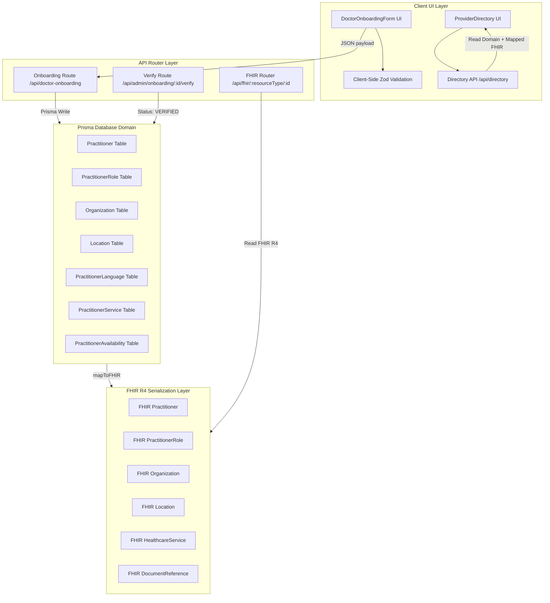

# Architectural Review — Doctor Onboarding & Provider Directory

This document provides a comprehensive architectural review of the **DrGodly Doctor Onboarding & Provider Directory** system, assessing the design against frontend usability, data modeling, database constraints, validation schema pipelines, HL7 FHIR R4 compliance, security parameters, scalability, and interoperability.

---

## 1. System Architecture

The following diagram illustrates the relationship between client-side components, backend API route boundaries, domain validation layers, database storage entities, and mapped HL7 FHIR resources.



---

## 2. Data Flow & Validation Pipeline

The system enforces a multi-tiered validation workflow to guarantee consistency and prevent malformed inputs from entering the registry:

```text
Client Input ➔ Client Zod Validation ➔ API Request ➔ Session Auth ➔ Server Zod validation ➔ Domain Database Persistence ➔ FHIR Serialization ➔ HL7 FHIR Schema Validation ➔ Production Directory Publication
```

### Validation Segments
1.  **Frontend (Form UI)**: Validates input strings step-by-step using Zod resolver models matching the domain specifications.
2.  **API Gateways**: Authenticates sessions via `better-auth`. Protects operations via explicit role validation (admin vs doctor).
3.  **Domain (Prisma)**: Enforces relational keys, database uniqueness constraints (e.g., maximum of one primary specialty per doctor), and cascading deletes on cascade-dependent records.
4.  **FHIR Validation**: Mapped resources are validated against HL7 R4 schema formats (cardinalities, identifiers, referencing models) before serialization.

---

## 3. Database Schema & Query Performance

The database schema is highly normalized:
*   **Practitioner**: Represents the provider identity and credentials.
*   **PractitionerSpecialty**: Multi-specialty support linked to SNOMED CT terminology.
*   **PractitionerQualification**: Mapped PG/UG degrees, universities, and issuing bodies.
*   **PractitionerRole**: Resolves the junction between a doctor, an organization, and clinic locations.
*   **PractitionerService**: Mapped consultation modes (video, audio, chat, offline) and regional pricing rates.
*   **PractitionerAvailability**: Day-of-week slots for specific clinic roles.

### Query Performance Indicators
*   Indexes exist on key identifiers like `Practitioner.userId`, `PractitionerRole.practitionerId`, `PractitionerRole.organizationId`, and `PractitionerService.roleId`.
*   Cascading behavior is enforced for dependent tables (`onDelete: Cascade`), ensuring that deleting an onboarding profile cleanly purges languages, qualifications, roles, and services.

---

## 4. HL7 FHIR R4 Serialization Layer

FHIR version `4.0.1` compliance is verified via comparison schemas against HL7 canonical representations:
1.  **Practitioner**: Encapsulates name parameters, gender, identifiers, qualifications, and communication languages.
2.  **PractitionerRole**: Links Practitioner to Organization, Location references, and HealthcareService lists.
3.  **HealthcareService**: Encapsulates consulting duration, modes, and active flags.
4.  **DocumentReference**: Holds metadata and access links to credential files.

---

## 5. Security & Privacy Model

1.  **IDOR Prevention**: Protected routes compare target entity properties (`practitioner.userId`) directly to the authenticated session identifier (`session.user.id`).
2.  **Document Protection**: File retrieval requires verification that the caller is either the owner doctor or an admin reviewer. Public endpoints block raw DocumentReference metadata and media URLs.
3.  **Data Isolation**: Only explicitly patient-visible attributes (display name, specialties, languages, consultation modes, clinic cities/states) are served in the search directory payload.

---

## 6. Scalability, Interoperability & Technical Debt

### Scalability Analysis
*   The schema is designed to scale to 100,000+ doctors. Multiple organizations and locations are supported through the junction relationships of `PractitionerRole` and `PractitionerRoleLocation` without duplication.
*   Consultation services support separate pricing per channel.

### Interoperability Design
*   The Practitioner and PractitionerRole resources are decoupled from the core UI, facilitating future integrations (such as ABDM registries or external FHIR servers).
*   The scheduling structure can cleanly participate in future HL7 workflows:
    `PractitionerRole` ➔ `HealthcareService` ➔ `Schedule` ➔ `Slot` ➔ `Appointment` ➔ `Encounter`.

### Technical Debt & Risks
*   **In-Memory API Filtering**: Currently, the directory API filters search results in memory. For 100,000+ records, this will degrade performance.
    *   *Recommendation*: Implement database-level indexing and full-text search parameters via Prisma `where` clause (e.g., Prisma pg-trgm indexes or full-text query modifiers).

---

## 7. Architectural Recommendations
1.  **DB Search Migration**: Move search filters to PostgreSQL database-level query operations rather than in-memory filtering.
2.  **FHIR Bundle caching**: Cache generated FHIR resources on the server side to speed up dynamic FHIR exports.
